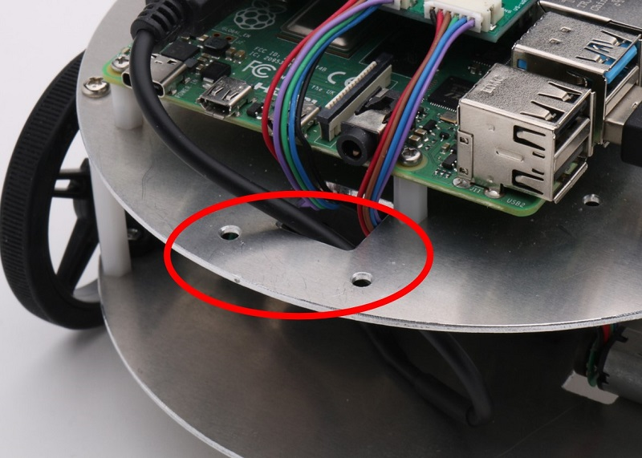
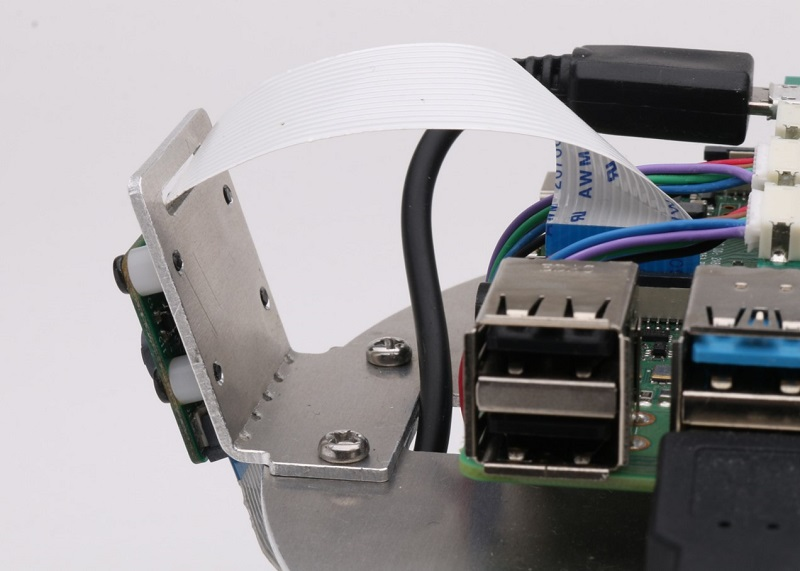
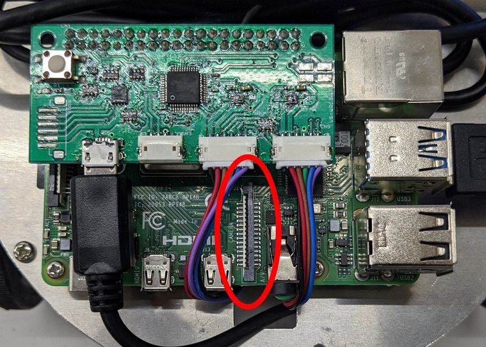

# ハードウェアセットアップ
ライトローバーにカメラを取り付けます。以下の手順で作業を行ってください。  
<br>
カメラのマウントをライトローバー本体にM3ネジとナットで固定します。  




Raspberry Piの所定の位置（画像赤丸）にカメラのケーブルを差し込みます。  

  

コネクタのロックを引き上げます。  


カメラのケーブルをコネクタが見えている側がRaspberry PiのHDMI端子側になるように差し込みます。  
この時、しっかり奥まで差し込みましょう。  


ケーブルを差し込んだら先ほど外したコネクタのロックを下ろします。


以上でハードウェアのセットアップは完了です。  

# OSの設定
ライトローバー用カメラオプションを使用するには、Raspberry Piの設定の変更が必要です。  
以下の手順でRaspberry Piの設定を変更し、カメラを有効にしてください。  

1. 画面左上のメニューから、設定->Raspberry Piの設定を選択します。
2. タブからインターフェイスを選択し、カメラの項目の有効にチェックを入れ、OKを選択します。 

# カメラで色認識をしよう
赤い物体を認識し、それを追跡するサンプルプログラムを用意しました。  

## ライブラリのセットアップ
ROSでカメラを利用するために必要な各種ライブラリをセットアップしていきます。  
なおここからの操作にはインターネット接続が必要です。 
まずは次のコマンドを実行します。
```
sudo apt install libv4l-dev v4l-utils qv4l2
```
<br>

次に各種パッケージをインストールします。  
バイナリでは配布されていないため、ソースからビルドします。   
<br>

ターミナルで以下のコマンドを入力し、catkin_wsへ移動します。  
```
cd ~/catkin_ws/src
```
次のコマンドで、Githubからimage_commonパッケージのソースをクローンします。  
```
git clone https://github.com/ros-perception/image_common.git
```
ビルドします。  
```
catkin build
```
<br>

次にGithubからuvc_cameraパッケージのソースをクローンします。  
```
git clone https://github.com/ros-drivers/camera_umd.git
```
ビルドします。  
```
catkin build
```
<br>

同様にGithubからcv_bridgeパッケージをクローンしビルドします。  
この時、ブランチにmelodicを指定するようにします。  
```
git clone -b melodic https://github.com/ros-perception/vision_opencv.git
```  
```
catkin build
```
<br>

最後にimage_pipelineパッケージをクローン・ビルドします。  
```
git clone https://github.com/ros-perception/image_pipeline.git
```  
```
catkin build
```
<br>

## サンプルプログラムのインストール
ライトローバーをカメラを使用して動作させるためのサンプルプログラムを準備します。  
ターミナルで以下のコマンドを入力し、catkin_wsへ移動します。  
```
cd ~/catkin_ws/src
```
<br>

以下のコマンドでGithubからlightrover_cam_optionパッケージをクローンします。  
```
git clone https://github.com/vstoneofficial/lightrover_cam_option.git
```
ビルドします。  
```
catkin build
```
続いて、導入したpythonスクリプトに以下のコマンドで実行権限を付けます。
```
sudo chmod +x ~/catkin_ws/src/lightrover_cam_option/scripts/*.py
```

## サンプルプログラムの実行
次のコマンドでサンプルプログラムを実行しましょう。  
```
roslaunch lightrover_cam_option rover_cam.launch
```
<br>
サンプルプログラムを実行すると、画面にカメラの画像が表示されます。  
赤い物体がカメラの画像内に表示されると、その部分が赤枠で囲まれ、  
それに追従するようにライトローバーが動作します。  

  

サンプルプログラムを変更することで、別の色の物体を追跡することなども可能になります。  
